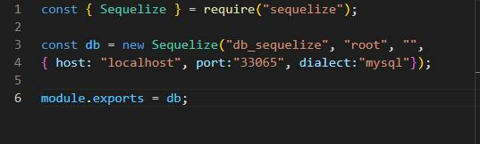
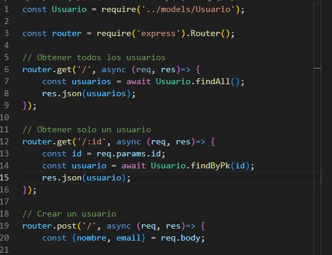
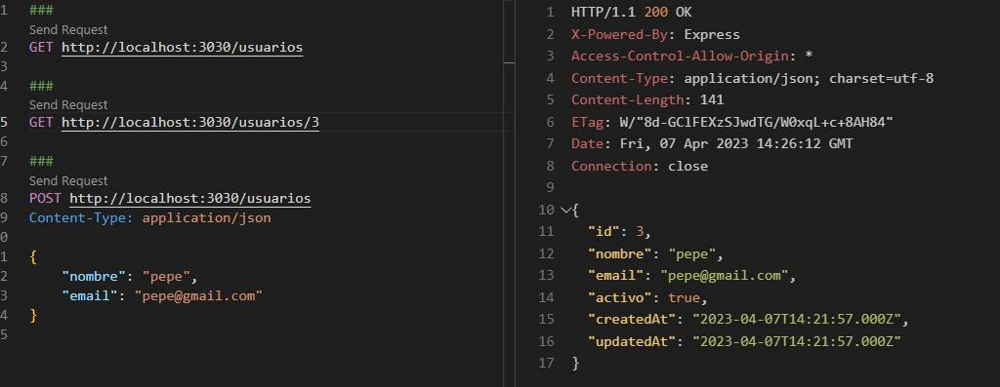

# API REST WITH NODEJS, EXPRESS, SEQUELIZE ORM, MYSQL.
Code to create API REST and testing with REST CLIENT.

## STACK TECH :wrench: :hammer:

* Node Js
* Express
* Mysql
* Extension VSCode REST CLIENT
* Sequelize ORM
* Yarn 
* Nodemon

# Commands 
* npm init -y 
* yarn add express
* yarn add -D nodemon
* yarn add cors
* yarn add sequelize
* yarn add mysql2

# SCREENSHOT

